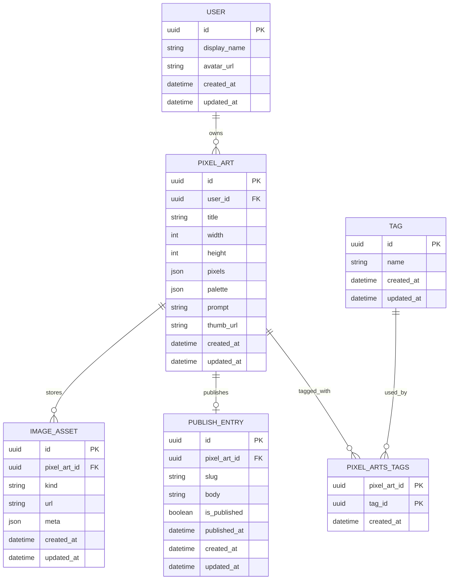

# データベース定義書

本書は「My Dot Gen」のアプリ固有DBスキーマを定義します。Auth.js が管理する認証系テーブルは範囲外です。対象はセカンドフェーズまでですが、タグ機能はセカンドフェーズで有効化します。

## 命名規約

- テーブル/カラム: スネークケース
- テーブル名: 複数形（例: `pixel_arts`, `tags`, `pixel_arts_tags`）

## ER 図（概念）



注: 公開メタの `PUBLISH_ENTRY` から配列 `tags` は廃止し、`PIXEL_ART` と `TAG` を多対多で接続します。

## DDL（PostgreSQL）

```sql
-- 必要拡張
CREATE EXTENSION IF NOT EXISTS pgcrypto;

-- users: アプリ内ユーザー
CREATE TABLE IF NOT EXISTS users (
  id           uuid PRIMARY KEY DEFAULT gen_random_uuid(),
  display_name text NOT NULL,
  avatar_url   text,
  created_at   timestamptz NOT NULL DEFAULT now(),
  updated_at   timestamptz NOT NULL DEFAULT now()
);

-- pixel_arts: ドット絵本体
CREATE TABLE IF NOT EXISTS pixel_arts (
  id          uuid PRIMARY KEY DEFAULT gen_random_uuid(),
  user_id     uuid NOT NULL REFERENCES users(id) ON DELETE CASCADE,
  title       text NOT NULL,
  width       int  NOT NULL CHECK (width  IN (16, 32, 64)),
  height      int  NOT NULL CHECK (height IN (16, 32, 64)),
  pixels      jsonb NOT NULL,   -- RLE/行列/座標色など実装に依存
  palette     jsonb,            -- 任意パレット
  prompt      text,
  thumb_url   text,
  created_at  timestamptz NOT NULL DEFAULT now(),
  updated_at  timestamptz NOT NULL DEFAULT now()
);

-- image_assets: 生成元/中間アセット参照
CREATE TABLE IF NOT EXISTS image_assets (
  id           uuid PRIMARY KEY DEFAULT gen_random_uuid(),
  pixel_art_id uuid NOT NULL REFERENCES pixel_arts(id) ON DELETE CASCADE,
  kind         text NOT NULL CHECK (kind IN ('source','thumbnail','intermediate')),
  url          text NOT NULL,
  meta         jsonb,
  created_at   timestamptz NOT NULL DEFAULT now(),
  updated_at   timestamptz NOT NULL DEFAULT now()
);

-- publish_entries: 公開用メタ (各作品0..1)
CREATE TABLE IF NOT EXISTS publish_entries (
  id            uuid PRIMARY KEY DEFAULT gen_random_uuid(),
  pixel_art_id  uuid NOT NULL UNIQUE REFERENCES pixel_arts(id) ON DELETE CASCADE,
  slug          text NOT NULL UNIQUE,
  body          text,
  is_published  boolean NOT NULL DEFAULT false,
  published_at  timestamptz,
  created_at    timestamptz NOT NULL DEFAULT now(),
  updated_at    timestamptz
);

-- tags: グローバルタグ（セカンドで有効化）
CREATE TABLE IF NOT EXISTS tags (
  id          uuid PRIMARY KEY DEFAULT gen_random_uuid(),
  name        text NOT NULL UNIQUE,
  created_at  timestamptz NOT NULL DEFAULT now(),
  updated_at  timestamptz NOT NULL DEFAULT now(),
  CONSTRAINT tags_name_len CHECK (char_length(name) <= 32)
);

-- pixel_arts_tags: 多対多（セカンドで有効化）
CREATE TABLE IF NOT EXISTS pixel_arts_tags (
  pixel_art_id uuid NOT NULL REFERENCES pixel_arts(id) ON DELETE CASCADE,
  tag_id       uuid NOT NULL REFERENCES tags(id) ON DELETE CASCADE,
  created_at   timestamptz NOT NULL DEFAULT now(),
  PRIMARY KEY (pixel_art_id, tag_id)
);

-- 推奨インデックス
CREATE INDEX IF NOT EXISTS idx_pixel_arts_user_created ON pixel_arts(user_id, created_at DESC);
CREATE INDEX IF NOT EXISTS idx_image_assets_pixel_art   ON image_assets(pixel_art_id);
CREATE INDEX IF NOT EXISTS idx_publish_published_at     ON publish_entries(is_published, published_at DESC);
CREATE INDEX IF NOT EXISTS idx_tags_name                ON tags(name);
CREATE INDEX IF NOT EXISTS idx_pat_art                  ON pixel_arts_tags(pixel_art_id);
CREATE INDEX IF NOT EXISTS idx_pat_tag                  ON pixel_arts_tags(tag_id);
```

## タグ正規化ルール（アプリ層）

- スコープ: グローバル（全ユーザーで共有）
- 正規化順序: `NFKC`→`trim()`→長さ検証（<=32）
- ユニーク性: 正規化後の文字列でユニーク扱い（DBは `UNIQUE(name)`、アプリは必ず正規化を適用）

```ts
// 擬似コード（保存前/検索前の統一処理）
function normalizeTag(input: string): string {
  const name = input.normalize('NFKC').trim();
  if (name.length === 0 || name.length > 32) throw new Error('Invalid tag length');
  return name;
}
```

## 既存からの移行（参考）

1. 追加: `tags`, `pixel_arts_tags`
2. 旧 `publish_entries.tags`（配列）を正規化展開→`tags` UPSERT→`pixel_arts_tags` に紐付け
3. 読み書きを新スキーマに切替
4. 検証後、旧カラム/関連インデックスを削除（本定義では既に廃止）

## フェーズ注記

- タグテーブルは先行作成可能だが、機能としての露出はセカンドフェーズで有効化する。
