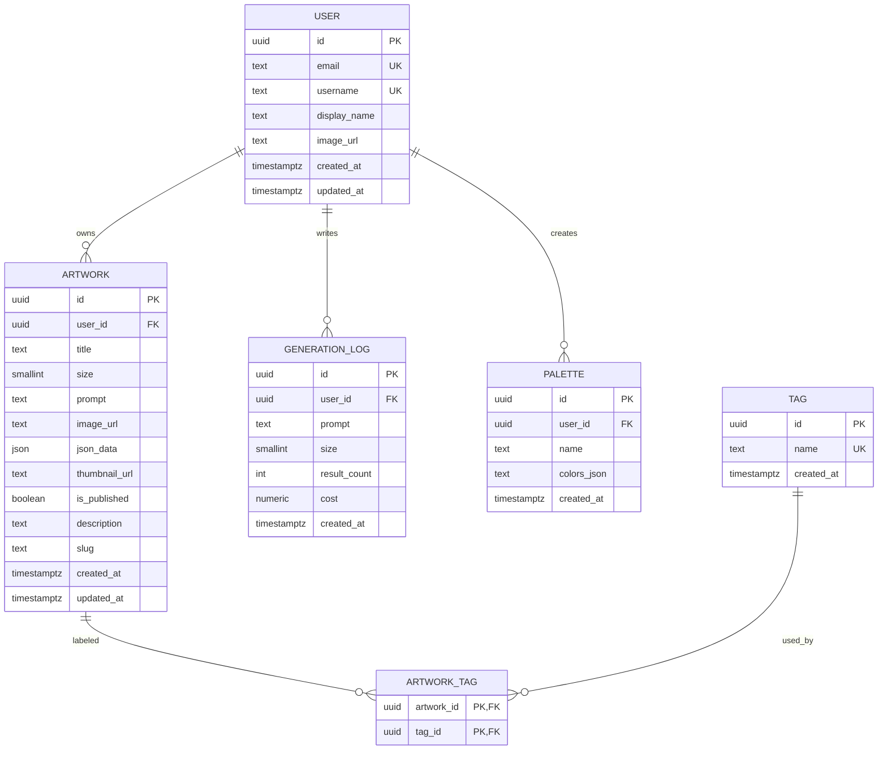
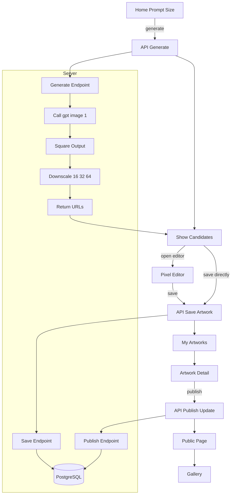
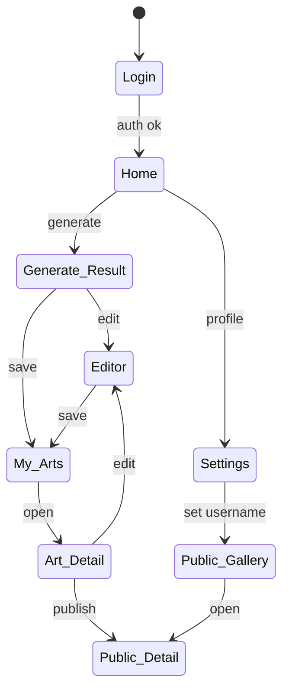

# データベース定義書

本書は「My Dot GEN」のセカンドフェーズまでを対象に、アプリ固有のデータベース定義、ER図、主要フロー図、画面遷移図を示します。Auth.js が管理する標準的な認証テーブルは範囲外とし、アプリで保持する最小限のモデルを定義します。

---

## ER図

エンティティ名に括弧は使用していません。



補足:
- PALETTE.colors はDBでは `text[]` を想定。ER図では表記簡略化のため `colors_json` と表しています。

---

## テーブル定義(第2期まで)

1) users
- id: UUID PK
- email: text UNIQUE NOT NULL
- username: text UNIQUE NULL  (公開用ID、英数字とハイフンのみ想定)
- display_name: text NULL
- image_url: text NULL
- created_at: timestamptz NOT NULL default now()
- updated_at: timestamptz NOT NULL default now()

2) artworks
- id: UUID PK
- user_id: UUID NOT NULL REFERENCES users(id) ON DELETE CASCADE
- title: text NOT NULL
- size: smallint NOT NULL CHECK (size IN (16,32,64))
- prompt: text NOT NULL
- image_url: text NOT NULL  (PNG 等の保存先URL)
- json_data: jsonb NULL     (ドット配列など任意データ)
- thumbnail_url: text NULL
- is_published: boolean NOT NULL DEFAULT false
- description: text NULL     (公開ページの本文)
- slug: text NULL UNIQUE     (公開URL用、公開時は必須)
- created_at: timestamptz NOT NULL default now()
- updated_at: timestamptz NOT NULL default now()

3) generation_logs
- id: UUID PK
- user_id: UUID NOT NULL REFERENCES users(id) ON DELETE CASCADE
- prompt: text NOT NULL
- size: smallint NOT NULL CHECK (size IN (16,32,64))
- result_count: int NOT NULL DEFAULT 1
- cost: numeric(10,4) NULL
- created_at: timestamptz NOT NULL default now()

4) palettes (任意)
- id: UUID PK
- user_id: UUID NOT NULL REFERENCES users(id) ON DELETE CASCADE
- name: text NOT NULL
- colors: text[] NOT NULL   (例: '#RRGGBB')
- created_at: timestamptz NOT NULL default now()

5) tags (第2期)
- id: UUID PK
- name: text NOT NULL UNIQUE  (小文字で正規化推奨)
- created_at: timestamptz NOT NULL default now()

6) artwork_tags (第2期)
- artwork_id: UUID NOT NULL REFERENCES artworks(id) ON DELETE CASCADE
- tag_id: UUID NOT NULL REFERENCES tags(id) ON DELETE CASCADE
- PRIMARY KEY (artwork_id, tag_id)

推奨インデックス
- idx_artworks_user_created: artworks(user_id, created_at DESC)
- idx_artworks_published: artworks(is_published)
- uidx_artworks_slug_published: UNIQUE ON artworks(slug) WHERE is_published = true
- idx_generation_logs_user_created: generation_logs(user_id, created_at DESC)
- idx_tags_name: tags(name)

---

## DDLサンプル(PostgreSQL)

```sql
CREATE EXTENSION IF NOT EXISTS pgcrypto;

CREATE TABLE users (
  id uuid PRIMARY KEY DEFAULT gen_random_uuid(),
  email text UNIQUE NOT NULL,
  username text UNIQUE,
  display_name text,
  image_url text,
  created_at timestamptz NOT NULL DEFAULT now(),
  updated_at timestamptz NOT NULL DEFAULT now()
);

CREATE TABLE artworks (
  id uuid PRIMARY KEY DEFAULT gen_random_uuid(),
  user_id uuid NOT NULL REFERENCES users(id) ON DELETE CASCADE,
  title text NOT NULL,
  size smallint NOT NULL CHECK (size IN (16,32,64)),
  prompt text NOT NULL,
  image_url text NOT NULL,
  json_data jsonb,
  thumbnail_url text,
  is_published boolean NOT NULL DEFAULT false,
  description text,
  slug text,
  created_at timestamptz NOT NULL DEFAULT now(),
  updated_at timestamptz NOT NULL DEFAULT now()
);

CREATE INDEX idx_artworks_user_created ON artworks(user_id, created_at DESC);
CREATE INDEX idx_artworks_published ON artworks(is_published);
CREATE UNIQUE INDEX uidx_artworks_slug_published ON artworks(slug) WHERE is_published = true;

CREATE TABLE generation_logs (
  id uuid PRIMARY KEY DEFAULT gen_random_uuid(),
  user_id uuid NOT NULL REFERENCES users(id) ON DELETE CASCADE,
  prompt text NOT NULL,
  size smallint NOT NULL CHECK (size IN (16,32,64)),
  result_count int NOT NULL DEFAULT 1,
  cost numeric(10,4),
  created_at timestamptz NOT NULL DEFAULT now()
);

CREATE TABLE palettes (
  id uuid PRIMARY KEY DEFAULT gen_random_uuid(),
  user_id uuid NOT NULL REFERENCES users(id) ON DELETE CASCADE,
  name text NOT NULL,
  colors text[] NOT NULL,
  created_at timestamptz NOT NULL DEFAULT now()
);

CREATE TABLE tags (
  id uuid PRIMARY KEY DEFAULT gen_random_uuid(),
  name text NOT NULL UNIQUE,
  created_at timestamptz NOT NULL DEFAULT now()
);

CREATE TABLE artwork_tags (
  artwork_id uuid NOT NULL REFERENCES artworks(id) ON DELETE CASCADE,
  tag_id uuid NOT NULL REFERENCES tags(id) ON DELETE CASCADE,
  PRIMARY KEY (artwork_id, tag_id)
);
```

---

## フロー図

生成から公開までの主要フローをテキスト化した図です。



---

## 画面遷移図

括弧を含まない名前で定義しています。



---

## 備考

- スラッグ生成: 英数字とハイフンのみ、重複時は末尾に短いサフィックスを追加。
- 画像保存: 画像URLはオブジェクトストレージへの参照。生成時は一時URL、保存時に恒久URLへ移行を想定。
- JSON形式: `json_data` はピクセル配列やRLE形式など実装に合わせて決定。
- レート制限: generation_logs を用いた制御を想定。
