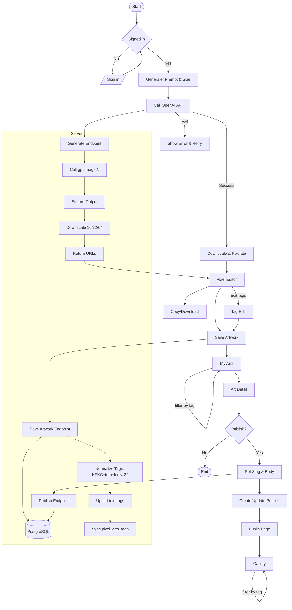

# フロー図

主要な業務フローを mermaid のフローチャートで示す。タグ機能はセカンドフェーズで有効化されます。

```mermaid
flowchart TD
  START([Start]) --> AUTH{Signed in}
  AUTH -- No --> SIGNIN[/Sign in/]
  SIGNIN --> AUTH
  AUTH -- Yes --> GENERATE[Generate: Prompt & Size]
  GENERATE --> CALL[Call OpenAI API]
  CALL -->|Success| PREP[Downscale & Pixelate]
  CALL -->|Fail| ERR[Show Error & Retry]
  PREP --> EDITOR[Pixel Editor]
  EDITOR --> SAVE[Save Artwork]
  SAVE --> MYARTS[My Arts]
  EDITOR --> COPY[Copy/Download]
  MYARTS --> DETAIL[Art Detail]
  DETAIL --> PUB{Publish?}
  PUB -- Yes --> PUBEDIT[Set Slug & Body]
  PUBEDIT --> PUBSAVE[Create/Update Publish]
  PUBSAVE --> PUBLIC_PAGE[Public Page]
  PUBLIC_PAGE --> GALLERY[Gallery]
  PUB -- No --> END([End])

  %% Tag operations (Second phase)
  EDITOR -->|edit tags| TAG_EDIT[Tag Edit]
  TAG_EDIT --> SAVE
  MYARTS -->|filter by tag| MYARTS
  GALLERY -->|filter by tag| GALLERY

  subgraph Server
    S1[Generate Endpoint] --> S2[Call gpt-image-1]
    S2 --> S3[Square Output]
    S3 --> S4[Downscale 16/32/64]
    S4 --> S5[Return URLs]
    S6[Save Artwork Endpoint] --> DB[(PostgreSQL)]
    S7[Publish Endpoint] --> DB
    %% Tag handling (Second)
    S6 -.-> N1[Normalize Tags: NFKC+trim+len<=32]
    N1 -.-> N2[Upsert into tags]
    N2 -.-> N3[Sync pixel_arts_tags]
  end

  CALL --> S1
  S5 --> EDITOR
  SAVE --> S6
  PUBEDIT --> S7
```

補足:

- タグ正規化はアプリ層で必須（NFKC→trim→<=32）。
- 検索はタグ複数指定AND、作者/サイズ等と複合可能。
