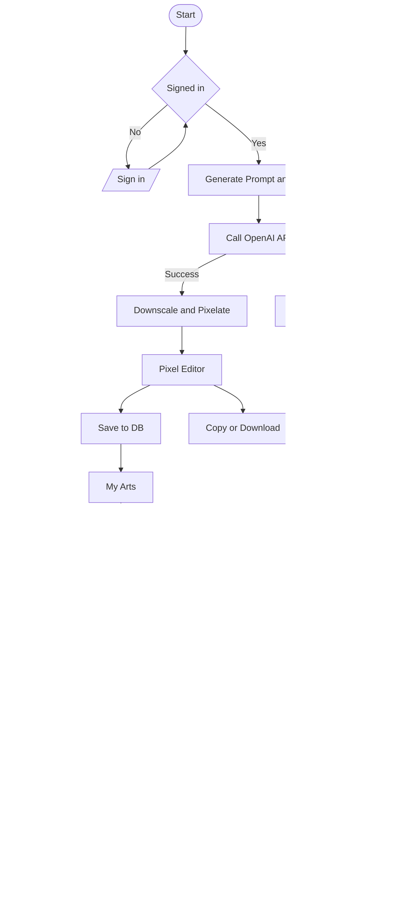

# 概要設計

## 概要

### アプリ名

My Dot GEN


### 目的

生成AIで自然文からドット絵を生成し、それを編集、保存、公開する。


### 要望のあらまし
- 自然文を入力するとドット絵を自動生成する。
- 使用するのは、OpenAIの画像生成APIを用いる。gpt-image-1
- ドット絵のサイズは、16x16, 32x32, 64x64のいずれか
- 画像生成APIは、出力するサイズが決まっているので、一度正方形のサイズで出力させたうえで、縮小する。
- 使用するカラーコードは8bitx3の自由なカラーコードが使えること。
- 生成した画像は、タイトルや、サイズを指定してデータベースに保存する。
- 画像データをコピーできる。
- ドット絵はWeb上で編集できる。
- ファーストフェーズはここまで
- セカンドフェーズとして、自分の作ったものをブログのように公開したい。
- サードフェーズとして、SNSのようにしたい。

### 技術仕様
- Typescript
- Next.js
- Auth.js
- prisma
- tailwindcss
- postgresql


## 機能一覧

- 生成AI連携: OpenAI `gpt-image-1` による画像生成、指定サイズ(16/32/64)への縮小変換。
- プロンプト入力: 自然文プロンプト、サンプル/テンプレ適用、生成回数/リトライ。
- 変換パイプライン: 正方形出力→最近傍縮小→ピクセル化→余白/トリミング調整。
- カラー: 24bit RGB 任意カラー(8bit x 3)、パレット編集/スポイト取得。
- エディタ: ペン/消しゴム/スポイト/塗りつぶし、ズーム/グリッド表示、Undo/Redo、ショートカット。
- 画像コピー/書き出し: クリップボードコピー(PNG/Data URL)、PNGダウンロード、SNS共有用サムネ生成。
- 保存/読み込み: タイトル/サイズ/サムネ/生成元プロンプトを含めてDBへ保存・更新・取得。
- 認証/認可: Auth.js によるログイン、本人のみ編集可能、公開可否の制御。
- マイ作品管理: 一覧/検索/ソート/重複保存(派生作成)。
- 公開(セカンド): 公開スイッチ、公開スラッグURL、説明文(マークダウン)添付、公開一覧表示。
- エラーハンドリング: 生成失敗/レート制限/ネットワーク障害時の再試行とユーザー通知。
- ログ/計測: 生成イベント、保存/公開操作の簡易メトリクス(後述の非機能で詳細化)。


## 画面一覧

- `/`: トップ
  - サービス紹介、サンプル、CTA(新規生成/マイ作品へ)。
- `/auth/sign-in` (またはプロバイダ選択モーダル): サインイン
  - OAuth/Email(方式は後で選定)。
- `/generate`: 生成
  - プロンプト入力、サイズ選択(16/32/64)、生成結果プレビュー、エディタへ送る動線。
- `/editor/:id?`: エディタ
  - ピクセルキャンバス、ツール/パレット、Undo/Redo、タイトル編集、保存/書き出し。
- `/my/arts`: マイ作品一覧
  - サムネ格子表示、検索/並び替え、編集/複製/削除。
- `/art/:id`: 作品詳細
  - サムネ/原寸、タイトル/サイズ/作成者、コピー/ダウンロード、公開設定(セカンド)。
- `/gallery` (セカンド): 公開ギャラリー
  - 公開作品一覧、作者/タグ/サイズフィルタ、並び替え。
- `/p/:slug` (セカンド): 公開ページ(ブログ風)
  - 作品・説明文・作成プロセスメモ、共有リンク。
- `/*`: 404/エラー
  - リンク案内、トップへ戻る。


## データモデル(サマリ)

- User: `id`, `displayName`, `avatar`, `createdAt`
- PixelArt: `id`, `userId`, `title`, `width`, `height`, `pixels`(圧縮/JSON/RLEのいずれか), `palette`(任意), `prompt`, `thumbUrl`, `createdAt`, `updatedAt`
- PublishEntry(セカンド): `id`, `pixelArtId`, `slug`, `body`(MD), `isPublished`, `publishedAt`
- ImageAsset(任意): 元生成画像/中間アセットの参照URL・メタ


## ユースケースフロー(要約)

1) ユーザーがログイン → `/generate` でプロンプト/サイズ選択 → OpenAI呼び出し → 生成結果を縮小/ピクセル化 → エディタで微調整 → タイトル付与して保存。
2) マイ作品一覧で再編集/複製/削除。必要に応じてコピー/PNGダウンロード。
3) セカンドフェーズでは、作品を公開に切替 → スラッグ付きページで共有/ギャラリーに掲載。


## 非機能(抜粋)

- パフォーマンス: エディタはキャンバス描画を最適化、最近傍補間での縮小をWebWorkerに切出し検討。
- セキュリティ: 認証必須操作の保護、公開時の最小限情報開示、APIキーのサーバ側保持。
- アクセシビリティ: キーボード操作、コントラスト、フォーカス管理。
- 運用: 生成レート制限、失敗時リトライ、ログ出力。


## フェーズ別対応範囲

### ファーストフェーズ(必須範囲)

- 機能
  - プロンプト入力/生成(16/32/64指定・縮小/ピクセル化)
  - エディタ(ペン/消しゴム/スポイト/塗り/ズーム/グリッド/Undo-Redo)
  - 24bitカラー対応(任意カラー)、パレット編集
  - 保存/読み込み(タイトル/サイズ/プロンプト/サムネ)
  - 画像コピー/PNGダウンロード
  - 認証(ログイン)・本人編集制御
  - マイ作品一覧

- 画面
  - `/` トップ(簡易)
  - `/auth/sign-in`
  - `/generate`
  - `/editor/:id?`
  - `/my/arts`
  - `/art/:id`
  - `/*` 404

### セカンドフェーズ(公開・閲覧の拡張)

- 機能
  - 公開スイッチ/非公開切替
  - 公開スラッグURL生成
  - 公開ページ本文(簡易Markdown)添付
  - 公開ギャラリー一覧/検索/並び替え
  - 共有用サムネ生成

- 画面
  - `/gallery`
  - `/p/:slug`
  - 公開設定UI(作品詳細内)


## セカンドフェーズまでで取り組むべき一覧(抜粋)

- 機能一覧(～セカンド)
  - 生成AI連携 + 縮小/ピクセル化パイプライン
  - エディタ(ペン/消し/塗り/スポイト/Undo/Redo/ズーム/グリッド)
  - 任意カラー/パレット編集
  - 保存/読み込み(タイトル/サイズ/プロンプト/サムネ)
  - 画像コピー/PNGダウンロード
  - 認証とアクセス制御
  - マイ作品一覧
  - 公開スイッチ/スラッグ/本文(MD)/ギャラリー/共有

- 画面一覧(～セカンド)
  - `/`, `/auth/sign-in`, `/generate`, `/editor/:id?`, `/my/arts`, `/art/:id`
  - `/gallery`, `/p/:slug`, `/*`

## データベース定義書

本節ではセカンドフェーズまでを対象に、ER図、テーブル定義、主要インデックス/制約を示す。Auth.jsが作成する認証関連テーブルは範囲外とし、アプリ固有の最小構成を定義する。

### ER図


注: `PUBLISH_ENTRY` は各 `PIXEL_ART` に対して0または1件。

### テーブル定義案(PostgreSQL)

```sql
-- users: アプリ内ユーザー情報
CREATE TABLE users (
  id           uuid PRIMARY KEY DEFAULT gen_random_uuid(),
  display_name text NOT NULL,
  avatar_url   text,
  created_at   timestamptz NOT NULL DEFAULT now(),
  updated_at  timestamptz
);

-- pixel_arts: ドット絵本体
CREATE TABLE pixel_arts (
  id          uuid PRIMARY KEY DEFAULT gen_random_uuid(),
  user_id     uuid NOT NULL REFERENCES users(id) ON DELETE CASCADE,
  title       text NOT NULL,
  width       int  NOT NULL CHECK (width  IN (16, 32, 64)),
  height      int  NOT NULL CHECK (height IN (16, 32, 64)),
  pixels      jsonb NOT NULL,   -- RLE/行列/そのままのいずれかの構造
  palette     jsonb,            -- 任意パレット情報(使用色配列など)
  prompt      text,
  thumb_url   text,
  created_at  timestamptz NOT NULL DEFAULT now(),
  updated_at  timestamptz NOT NULL DEFAULT now()
);

-- image_assets: 生成元画像や中間成果物の参照
CREATE TABLE image_assets (
  id           uuid PRIMARY KEY DEFAULT gen_random_uuid(),
  pixel_art_id uuid NOT NULL REFERENCES pixel_arts(id) ON DELETE CASCADE,
  kind         text NOT NULL CHECK (kind IN ('source','thumbnail','intermediate')),
  url          text NOT NULL,
  meta         jsonb,
  created_at   timestamptz NOT NULL DEFAULT now(),
  updated_at  timestamptz NOT NULL DEFAULT now()
);

-- publish_entries: 公開用メタ情報(各作品につき0..1)
CREATE TABLE publish_entries (
  id            uuid PRIMARY KEY DEFAULT gen_random_uuid(),
  pixel_art_id  uuid NOT NULL UNIQUE REFERENCES pixel_arts(id) ON DELETE CASCADE,
  slug          text NOT NULL UNIQUE,
  body          text,
  is_published  boolean NOT NULL DEFAULT false,
  tags          text[],
  published_at  timestamptz,
  created_at    timestamptz NOT NULL DEFAULT now(),
  updated_at    timestamptz
);

-- 推奨インデックス
CREATE INDEX idx_pixel_arts_user_created ON pixel_arts(user_id, created_at DESC);
CREATE INDEX idx_image_assets_pixel_art   ON image_assets(pixel_art_id);
CREATE INDEX idx_publish_published_at     ON publish_entries(is_published, published_at DESC);
CREATE INDEX idx_publish_tags_gin         ON publish_entries USING GIN (tags);
```

### データ項目メモ

- pixels: JSON構造は実装選択(RLE配列、行列、座標色リスト)を許容。表示/編集性能を優先して決定する。
- palette: 使用色リストおよびカラーネーム等を含める想定。未指定時は空配列扱い。
- slug: 公開URL識別子。英数とハイフンのみ、長さ制限をアプリ側で検証。
- is_published/published_at: 公開可否と公開日時。ギャラリーはこれでフィルタリング。


## フロー図

生成〜編集〜保存〜公開の主要フローを示す。




## 画面遷移図

主要画面間の遷移パスを示す。


