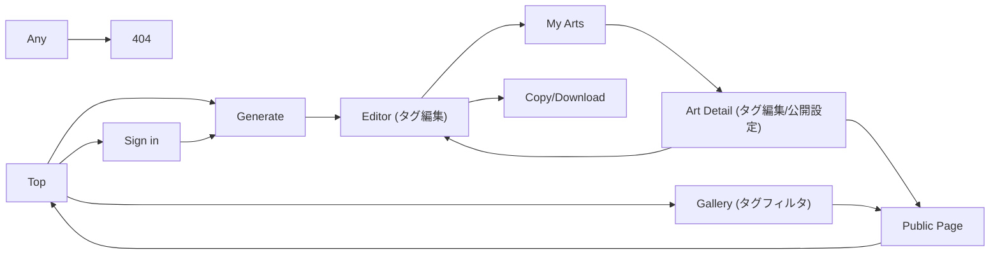

# 画面遷移図

主要画面間の遷移を示します。タグ編集/フィルタはセカンドフェーズで有効化されます。

```mermaid
flowchart LR
  ROOT[Top] --> GENERATE[Generate]
  ROOT --> SIGN_IN[Sign in]
  SIGN_IN --> GENERATE

  GENERATE --> EDITOR["Editor (タグ編集)"]
  EDITOR --> MY_ARTS[My Arts]
  EDITOR --> COPY[Copy/Download]

  MY_ARTS --> ART_DETAIL["Art Detail (タグ編集/公開設定)"]
  ART_DETAIL --> EDITOR
  ART_DETAIL --> PUBLIC_PAGE[Public Page]

  ROOT --> GALLERY["Gallery (タグフィルタ)"]
  GALLERY --> PUBLIC_PAGE
  PUBLIC_PAGE --> ROOT

  ANY[Any] --> NOT_FOUND[404]
```

注:
- タグ編集は Editor/Art Detail で行い、保存時に正規化・紐付けが実施されます。
- ギャラリーはタグ複数指定ANDフィルタに対応します。
